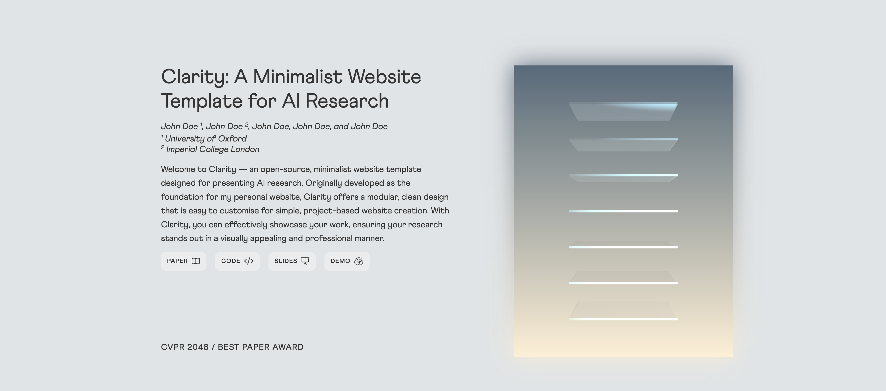
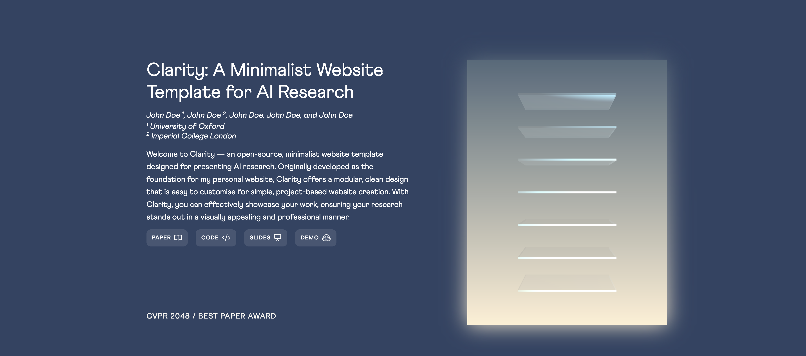
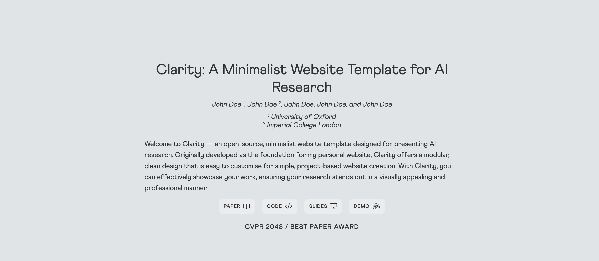
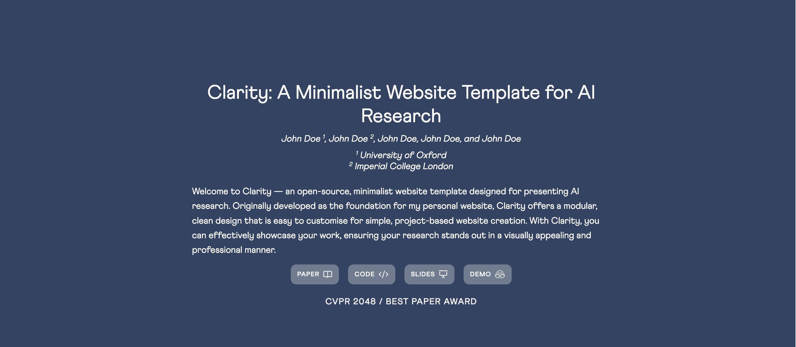
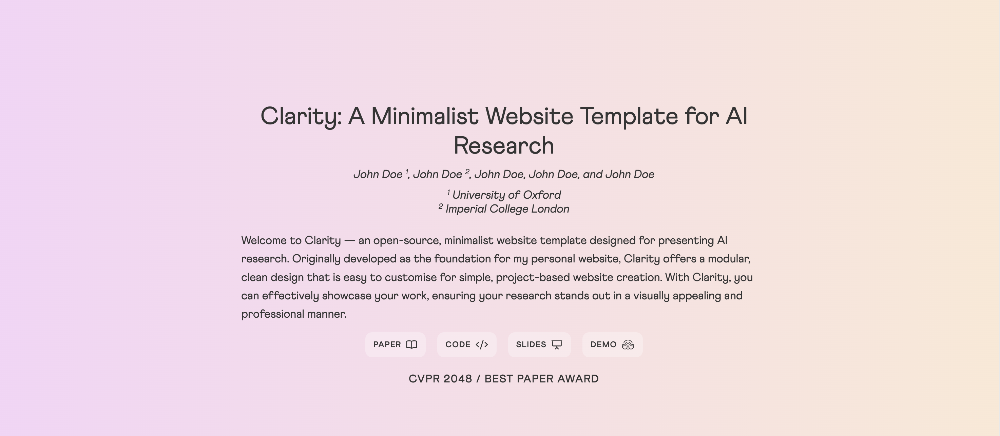
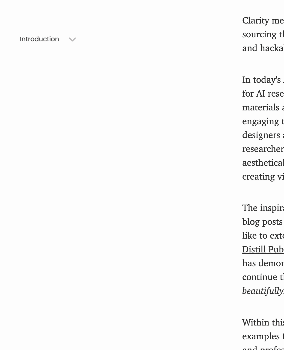
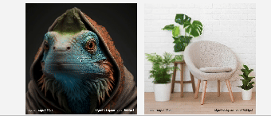

# Clarity Template

Clarity is an open-source, minimalist website template designed specifically for presenting AI research. It features a modular and clean design that is easy to customise for creating simple, project-based websites. With Clarity, you can effectively showcase your work, ensuring your research stands out in a visually appealing and professional manner. 

## Design Showcase

- Clarity Light Theme with Project Cover:
```css
<div class="container blog" id="first-content" style="background-color: #E0E4E6;">
    <div class="blog-title">
```


- Clarity Dark Theme with Project Cover:
```css
<div class="container blog" id="first-content" style="background-color: #304463;">
    <div class="blog-title white">
```


- Clarity Light Theme without Project Cover:
```css
<div class="container blog" id="first-content" style="background-color: #304463;">
    <div class="blog-title no-cover">
```


- Clarity Dark Theme without Project Cover:
```css
<div class="container blog" id="first-content" style="background-color: #E0E4E6;">
    <div class="blog-title white no-cover">
```


- Clarity Gradient Theme without Project Cover:
```css
<div class="container blog" id="first-content" style="background: linear-gradient(90deg, hsla(298, 68%, 90%, 1) 0%, hsla(30, 82%, 91%, 1) 100%);">
    <div class="blog-title no-cover">
```


*Note: The design showcase uses the licensed font option along with the complete FontAwesome Pro icon set.*


## Update
- **Jan. 12, 2025**: Feature update with `navbar` design for hoverable table of content (thanks [@yongyizang](https://github.com/yongyizang) for his generous contribution). Please comment out or in `<script src="assets/scripts/navbar.js"></script>` to activate or deactivate this feature.
<p align="center">
  
  
</p>

- **Oct. 28, 2024**: Feature update with `slideshow` design for automated slideshow display. For detailed usage and instructions, please refer to the `clarity.html` file.

<p align="center">
  
</p>

- **Oct. 24, 2024**: Feature update with `no-cover` design for title page design layout. For anyone prefer a title page design without a project cover, change `<div class="blog-title">` into `<div class="blog-title no-cover">`.
- **Aug. 26, 2024**: Feature update with comparison display / [46ec3ee](https://github.com/lorenmt/clarity-template/commit/46ec3eee19ea86775982e3c93c5b35716bad2d09) suggested in  [Issue #1](https://github.com/lorenmt/clarity-template/issues/1#issue-2485070942).

<p align="center">
  
</p>

## Usage
Please follow the visual guidelines outlined in the [Clarity blog post](https://shikun.io/projects/clarity) or the `clarity.html` file to optimise visual layouts and design. Additionally, a minimalist example template, `minimal.html`, is provided to help you get started quickly.

Clarity offers two font options: 
1. [Charter](https://practicaltypography.com/charter.html) + [Poppins](https://fonts.google.com/specimen/Poppins): free fonts available for commercial use. 
2.  [Tiempos Text](https://klim.co.nz/retail-fonts/tiempos-text/) + [Athletics](https://familytype.co/#athletics): licensed fonts with the trial license available for non-commercial use.

By default, the template uses the free fonts. To switch to the licensed fonts, follow these steps: 
1. Download the trial license or purchase the full license and place the font files in the  `assets/fonts` directory.
2. Optionally, use a [web font converter](https://transfonter.org/) to ensure compatibility across different browsers.
3. Update the font-size and default font options in `assets/stylesheets/_master.scss` (just comment in and out). 
4. Change the corresponding CSS file path to `assets/stylesheets/main.css` in your project HTML file. 
5. To further improve the visual aesthetics, please consider purchasing the  [FontAwesome Pro](https://fontawesome.com/plans) for a complete icon set, and update `<link href="assets/fontawesome-free-6.6.0-web/css/all.min.css" rel="stylesheet">` with `<link href="assets/fontawesome-pro-6.6.0-web/css/all.min.css" rel="stylesheet">` in the `<head>` tag.

## License
This project follows  <a href="https://creativecommons.org/licenses/by-sa/4.0/"><b>Creative Commons Attribution-ShareAlike 4.0 International License</b></a>. This allows you to freely modify and distribute the template in any way you like. In return, I kindly ask that you link back to the [Clarity blog post](https://shikun.io/projects/clarity) in the footer to acknowledge my work and efforts. Enjoy!
